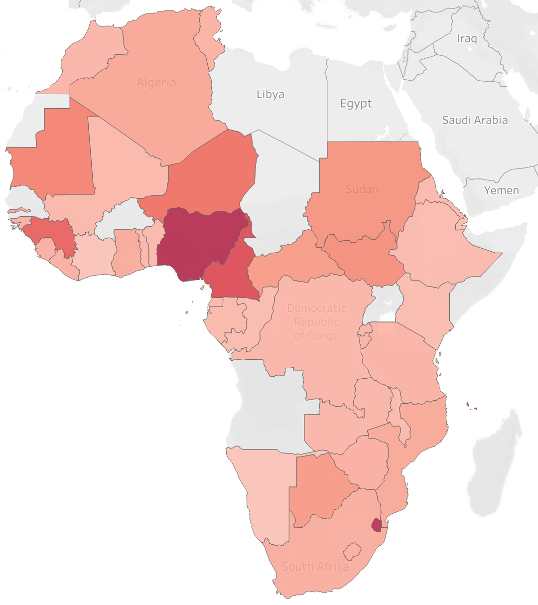

# ViEWS2 Ensemble

## Overview
This repo implements a version of the [Violence Early-Warning System (ViEWS)](https://www.pcr.uu.se/research/views/), developed by [Uppsala University's Department of Peace and Conflict Research](https://www.pcr.uu.se/?languageId=1). Building on the [open source work](https://github.com/UppsalaConflictDataProgram/OpenViEWS2) of the ViEWS team, we provide a machine learning based ensemble model to predict state based violence throughout Africa. The ensemble of random forest classifiers uses a variety of open source data that has been collated by the ViEWS team into a single, large data frame containing over 3,000 features. The model predicts probability of violence 3 years into the future and should be retrained using updated data every few months to ensure the most accurate predictions. 
 
This ensemble model is exposed via a command line interface (CLI) which allows a modeler to perturb key model parameters prior to executing the pre-trained ensemble to predict future violence in a given country.

# Contents

1. [Usage](#usage)
2. [Inputs](#inputs)
3. [Models](#models)
4. [The ViEWS Framework](#the-views-framework)
5. [The Ensemble Workflow](#the-ensemble-workflow)
    - [Dockerization](#dockerization)
    - [Model Parameters](#model-parameters)
    - [Parameterization by Country](#parameterization-by-country)
6. [Citation](#citation)

# **Usage**

The quickest way to get started with the ViEWS Ensemble is by using our pre-built Docker image `jataware/views2_ensemble`. To use this, you should first run 

```
docker pull jataware/views2_ensemble
```

Then from this repository run:

```
cd OpenViEWS2
python3 fetch_data_models.py
```

This will download and unzip all appropriate models and input data from S3. Depending on your network connection, this could take between 1 to 2 hours. Once completed, you are ready to run the model. You can do so with:

```
docker run \
	-v $PWD/storage:/usr/local/src/Views_dir/storage/ \
	-v $PWD/results:/usr/local/src/Views_dir/storage/predictions/ \
	jataware/views2_ensemble \
	--start_date 2020-10 \
	--end_date 2023-11
```

This will produce a baseline prediction for 2020-10 through 2023-11 and include no parameter perturbations. 



In the map above, the darker color indicates a higher level of average predicted conflict during the forecast period.

Additionally, the user may perturb specific parameters. See the section on [Model Parameters](#model-parameters) for how to submit additional parameters. Below, we can see that by perturbing various parameters, the level of predicted conflict for Ethiopia varies over time.


This simulated prediction was generated with the following Docker command:

```
docker run \
	-v $PWD/storage:/usr/local/src/Views_dir/storage/ \
	-v $PWD/results:/usr/local/src/Views_dir/storage/predictions/ \
	views_params \
	--start_date 2020-10 \
	--end_date 2023-11 \
	--country Ethiopia \
	--gdp_pcap -0.25 \
	--infant_mortality 0.25 \
	--liberalDemocracyIndex -0.35 \
	--foodProdIndex -0.2
```

Here we simulate a case where Ethiopia has a systemic shock at the outset of the simulation, causes a 25% reduction in GDP per capita, a 25% increase in infant mortality, a 35% decrease in liberal democracy, and a 20% decrease in food production.

Note that in either case, two volumes are mounted to the Docker container:

1. `/storage` contains the models and input data
2. `/results` will contain the model outputs. **Run results can be found here.**

For development, testing, and debugging you may wish to run the ensemble model locally. To do this, you can find more [detailed instructions here]
 
## Inputs

The data used in the ensemble model is open source and can be found in the following databases:

> **Note:** all columns or features in the dataframe expected by the ensemble model are prefixed by their source database. For example `Acled_` prefixed columns indicate data that is from [ACLED](https://acleddata.com/resources/general-guides/#1603120929158-3f359ee4-4726). Below are the prefix and associated data sources for all the features used in this ensemble.
  
1. **Fvp**:
This combines multiple databases; columns prefixed `prop_` are from [EPR](https://icr.ethz.ch/data/epr). Columns prefixed `ssp2` are from [SSP](https://tntcat.iiasa.ac.at/SspDb/) and auto, demo, electoral, etc are from [VDEM](https://www.v-dem.net/en/)
2. **Reign**:
[Rulers, Elections, and Irregular Governance dataset](https://oefdatascience.github.io/REIGN.github.io/menu/REIGN_CODEBOOK.html)
3. **Acled_**:
[The Armed Conflict Location & Event Data Project](https://acleddata.com/resources/general-guides/#1603120929158-3f359ee4-4726)
4. **Ged_**:
[UCDP Georeferenced Event Dataset](https://ucdp.uu.se/downloads/)
5. **Icgcw**:
[CrisisWatch](https://www.crisisgroup.org/crisiswatch)
6. **vdem_**:
[Varieties of Democracy](https://www.v-dem.net/media/filer_public/28/14/28140582-43d6-4940-948f-a2df84a31893/v-dem_codebook_v10.pdf)
7. **Wdi_**:
[World Development Indicators](https://databank.worldbank.org/source/world-development-indicators)

## Models
There are 14 models used in this ensemble. They all predict state based violence for a given country month. The `cm` stands for country month, the `sb` stands for state based violence. Each model has its own feature with some overlapping features between models within the ensemble. 

 1. `cm_sb_acled_violence`
 2. `cm_sb_cflong`
 3. `cm_sb_neibhist`
 4. `cm_sb_cdummies`
 5. `cm_sb_acled_protest`
 6. `cm_sb_reign_coups`
 7. `cm_sb_icgcw`
 8. `cm_sb_reign_drought`
 9. `cm_sb_reign_global`
 10. `cm_sb_vdem_global`
 11. `cm_sb_demog`
 12. `cm_sb_wdi_global`
 13. `cm_sb_all_global`
 14. `cm_sbonset24_25_all`

## The ViEWS framework
The ViEWS framework can be found on [Github](https://github.com/UppsalaConflictDataProgram/OpenViEWS2). The ViEWS team are experts on predicting violence using machine learning and open sourced this framework for anyone to use for modeling state based conflict.  

For more information on how the ViEWS framework is set up and how to get started, refer to their [detailed documenation](https://views.pcr.uu.se/download/docs/views.pdf).

Though the ViEWS framework allows modelers to generate their own models, we decided to implement an ensemble of the ViEWS' team standard models which are used for their monthly, public predictions for areas around the world. An example of monthly prediction report can be found [here](http://files.webb.uu.se/uploader/1576/ViEWS-Reports--53-.pdf).

## The ensemble workflow
In our workflow, each of the 14 models within the ensemble (all random forests) runs indepdently to generate its own prediction. These predictions are averaged to generate a composite prediction. 

The workflow for training this ensemble is neither quick nor simple due to large space and memory requirements needed to run all 14 models. In total, all the data and cached models are ~70GB. Our goal was to Dockerize a pre-trained version of this ensemble to minimize end-user effort and computation, while offering a reasonable degree of flexibility around perturbing a key set of input parameters. 

### Dockerization
Originally we attempted to save the 14 pre-trained models directly in the Docker image so they would always be available for any user who `docker pulls` the container. Unfortunately, the Docker image including all models and data is 83GB and is impractical for storage on a common Docker registry such as DockerHub. To mitigate this issue we store the pre-trained models and data in an Amazon S3 Bucket; these are copied to the ready Docker container prior to each model run. 

After the models/data are downloaded we activate the `views2` environment in our Docker container and run the `sb_ensemble.py` script to run the ensemble model.

### Model parameters
The model allows the user to make parameter selections prior to the model run. These are:

looks for any parameters passed by the user to determine if the dataframe needs to be perturbed before a prediction is made. The parameters we exposed are:

- `--start_date`: prediction start.
- `--end_date`: prediction end.
- `--country`: if country is defined only the country passed to the ensemble will be perturbed before prediction, otherwise all countries are modeled.
- `--gdp_pcap`: a percentage perturbation against gpd per capita (`wdi_ny_gdp_pcap_pp_kd`) where 0 is baseline (no perturbation)
- `--infant_mortality`: a percentage perturbation against annual infant mortality rate (`wdi_sp_dyn_imrt_in`) where 0 is baseline (no perturbation)
- `--liberalDemocracyIndex`: a percentage perturbation against liberal democracy index where 0 is baseline (no perturbation)
- `--foodProdIndex`: a percentage perturbation against the food production index where 0 is baseline (no perturbation).

### Parameterization by country

A complete list of countries which may be selected for parameterization can be found in [`countries.csv`](countries.csv).

## Citation
> ViEWS:
Hegre, Håvard, Marie Allansson, Matthias Basedau, Michael Colaresi, Mihai Croicu, Hanne Fjelde, Frederick Hoyles, Lisa Hultman, Stina Högbladh, Naima Mouhleb, Sayeed Auwn Muhammad, Desiree Nilsson, Håvard Mokleiv Nygård, Gudlaug Olafsdottir, Kristina Petrova, David Randahl, Espen Geelmuyden Rød, Nina von Uexkull, Jonas Vestby (2019) ‘ViEWS: A political violence early-warning system’, _Journal of Peace Research_, 56(2), pp. 155–174. doi: [10.1177/0022343319823860](https://doi.org/10.1177/0022343319823860).

> **Github**: [https://github.com/UppsalaConflictDataProgram/OpenViEWS2](https://github.com/UppsalaConflictDataProgram/OpenViEWS2)
